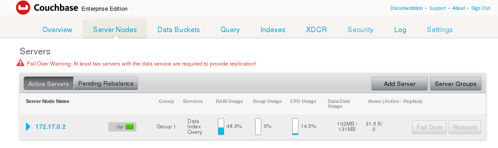

# CouchbaseSamples

Installation rapide avec Docker
https://developer.couchbase.com/documentation/server/4.6/getting-started/do-a-quick-install.html

On démarre un premier noeud qui contient des données
docker run -t --name couchbase-sandbox -p 8091-8094:8091-8094 -p 11210:11210 -d couchbase/server:sandbox
accéder à l'interface d'administration http://localhost:8091/ : Administrator/password
La version est : Version: 4.5.0-2601 Enterprise Edition (build-2601)

Sur cet écran on note qu'il y a un seul noeud dans notre cluster (on note au passage son adresse IP docker)

Création d'un second noeud
docker run -t --name couchbase-node-2 -p 8095-8098:8091-8094  -d couchbase/server:enterprise-4.6.3

Documentation sur les images docker : https://github.com/couchbase-guides/couchbase-docker

Start using the SDK
https://developer.couchbase.com/documentation/server/4.6/sdk/nodejs/start-using-sdk.htmldocker
